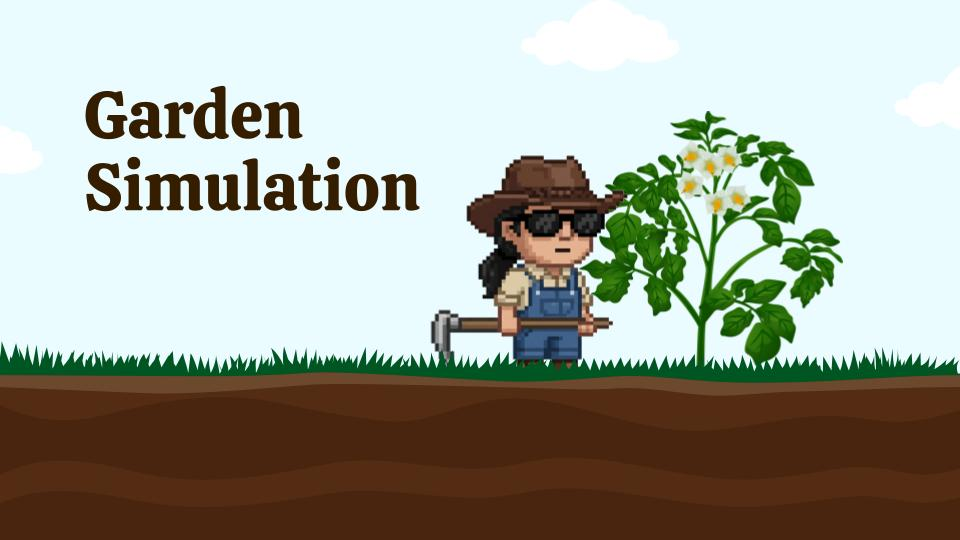

<h1 align="center">🌱🌿 Java-Garden-Simulator 🌿🌱</h1>




[](https://www.oracle.com/java/)
[](https://openjfx.io/)
[](https://www.jetbrains.com/idea/)


## 📋 Requirements
* Java 25+

## ✨ Features
* A GUI garden that allow the user to plant various types of plants, change the temperature, change the weather, and spawn pest infestations.
* An API that allows for headless simulation of the garden.  A config.json will be used to randomly plant specifc plant.

## 🗂️ Repository Structure
```
Garden-Simulator
├── src/                 
│    └── main/                           
│          ├── java/
│          │     ├── org.gardensim/
│          │     │       ├── controllers/           # Contains the garden controller which holds the entire GUI game logic
│          │     │       ├── core/                  # Application and Launcher file to launch JavaFX
│          │     │       ├── plants/                # Contains all plant classess and enums
│          │     │       ├── systems/               # Contains Water/Temp/Pest systems and the API
│          │     │       ├── utils/                 # Helper classer
│          │     │       └── GardenSimulator.java   # File to run a Headless Simulation 
│          │     └── module-info.java
│          └── resources/
│                ├── Assets/                        # Contains all graphical assets for the garden including plants, leaves, dirt, farmer
│                ├── documents/                     # UML Diagrams
│                ├── imgs/                          # misc imgs for documentation
│                ├── org.gardensim/                 # view.fxml
│                ├── config.json                    # config for the headless simulation
│                └── style.css                      # css styling for the GUI dashboards, labels, and progress bars
│
│
├── sim-logs.txt
└── README.md
```


## 🙋🏻‍♂️ How to Use
* **Headless**
  *  Optionally navigate to src/main/resources/config.json and edit the numerical values to change the amount of plants you would like to be initially planted.
  *  Run the file src/main/java/org.gardensim/GardenSimulator.java
     * By default, this file will run for 24 hours and randomize the API calls to the garden.
     * Optionally you can change this file and utilize any of the API calls specified in src/main/java/org.gardensim/systems/GardenSimulationAPI.java
* **GUI**
  * Run the file src/main/java/org.gardensim/core/Launcher.java
  * On the left hand side you have the ability to type in a number in the text fields to pick how many of each plant you want to have.
  * To initially plant the plants you need to click the Confirm button.  Once you do this, you can continue to click the confirm button to randomize the plant placement.  Optionally you can click on one of the plants in the dirt garden, and once you select it, other available square will light up.  These lit up square are available to move the plant to.  By simply clicking on a lit square, you will move the plant there.  Once you click start, you will not be able to move any plants.
  * Once you are satisfied with the plant placement you may click start if you are ready to begin the simulation.
  * On the right hand side of the screen is a dashboard that allows you to change the temperature, make it rain, or spawn in pests.  Temperature must be an integer in the range 40 to 120 and rain must be a positive integer.
  * The garden is built with a pest management system and has 10 pesticides for each pest.  For the first 10 pests of one type that you spawn in, they will instantly be killed by the pesticide.  After that, when you spawn in the 11th pest of the same type in will remain in the garden.


## Credits
* **Environment Textures**: [Megascans](https://quixel.com/megascans/) by Quixel / Epic Games.


